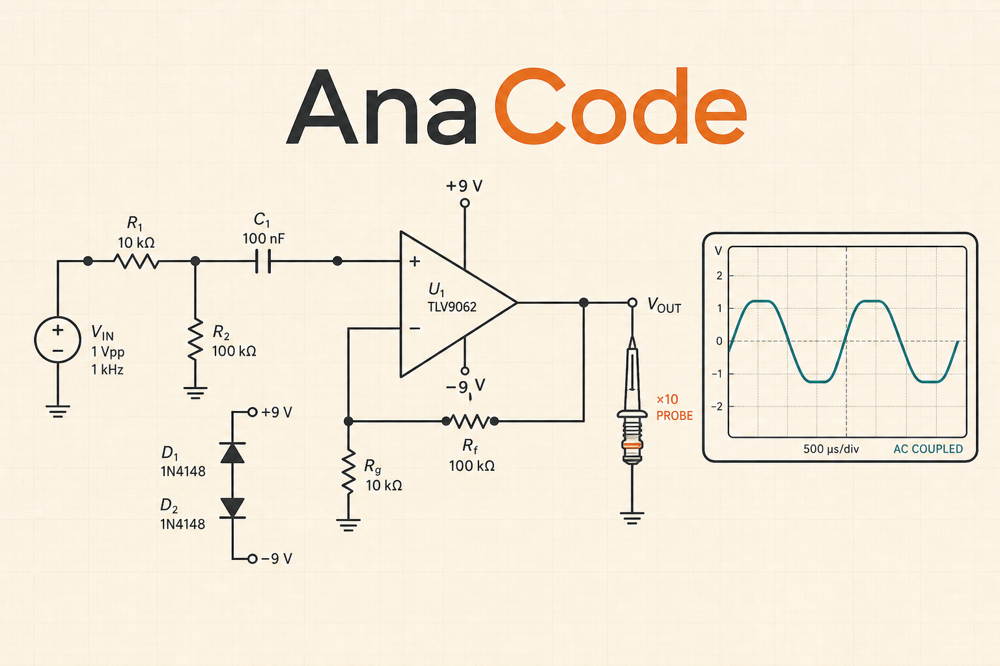

# AnaCode

<p align="center">
  
</p>

**Live deployment:** [https://anacode.ross0907.workers.dev](https://anacode.ross0907.workers.dev)

AnaCode is an analog-first circuit-design practice platform built around the idea that circuit problems are better learned by drawing, simulating, measuring, and verifying real schematics than by answering multiple-choice questions.

The project combines a browser-based schematic editor, ngspice-backed simulation, oscilloscope-style instrumentation, structured circuit data, and server-side grading for selected fixed-topology challenges.

## Project overview

AnaCode currently contains nine analog and digital circuit challenges covering operating-point, AC, transient, and DC-sweep analysis. Three challenges have server-owned fixed-topology graders: a precision divider, a 1 kHz RC low-pass filter, and an inverting gain stage. The remaining challenges are simulation-oriented practice problems.

The editor is designed to feel closer to a compact electronics workbench than a generic graph editor. It includes conventional schematic symbols, orthogonal wiring, automatic branch junctions, draggable wire segments, multi-selection, connected group movement, labels, global power ports, local grounds, undo/redo, zoom and pan, source controls, voltage probes, and bounded project import/export.

Simulation results are presented through oscilloscope, curve-tracer, and Bode magnitude/phase views. Up to four voltage channels can be inspected with scaling, coupling, triggering, cursors, measurements, and an accessible data table.

## Architecture

```text
visual schematic ──> presentation document ──> strict CircuitDocument
                                                └──> CircuitIR ──> generated SPICE deck
                                                                      └──> browser Web Worker
                                                                           ├──> spice-ts structural preflight
                                                                           └──> ngspice-WASM ──> instruments

same strict CircuitDocument ──> /api/grade ──> parse + compile to CircuitIR
                                                  └──> exact topology/stimulus verification
                                                        └──> versioned engineering checks
                                                              └──> D1 persistence when authenticated
```

The visual editor does not submit arbitrary SPICE text to the grading API. Its presentation state is converted to a versioned Zod-validated `CircuitDocument`, normalized into `CircuitIR`, and rendered into a generated solver deck for preview simulation.

For graded challenges, the server independently parses and recompiles the submitted electrical document, verifies its graph and stimulus against a server-owned topology, and recomputes the result. Browser simulation output is therefore a learning and measurement tool rather than grading evidence.

Further design detail is available in [docs/architecture.md](docs/architecture.md), [SECURITY.md](SECURITY.md), and [docs/product-landscape.md](docs/product-landscape.md).

## Browser simulation

The browser preview uses `eecircuit-engine@1.7.0`, which provides the ngspice WebAssembly runtime, together with `@spice-ts/core@0.3.0` for bounded structural parsing before execution.

The simulator path applies limits to input size, line count, component count, returned points, source events, probe count, and accepted analysis directives. The worker accepts operating-point, AC, transient, and DC-sweep analyses and isolates simulator execution from the main UI thread.

Generated CMOS examples use the bundled `N90` and `P90` BSIM4 benchmark models. These are generic educational models rather than a foundry PDK or silicon-signoff model.

The exact simulator package version, artifact hashes, runtime banner, and provenance investigation are recorded in [docs/simulator-artifact-manifest.json](docs/simulator-artifact-manifest.json) and [docs/simulator-provenance.md](docs/simulator-provenance.md).

## Grading and trust model

AnaCode treats the browser as untrusted. Client-side previews, modified UI state, forged requests, and user-edited solver text do not alter the server-owned grading rules.

The three current authoritative graders use deterministic engineering equations after validating the circuit topology and stimulus. Free-topology authoritative native-SPICE grading remains a roadmap item rather than a feature represented as complete in this repository.

The grading API also contains replay-safe idempotency handling and a shared fixed-window D1 rate-limit bucket keyed by a pseudonymized client address.

## Data and identity

Cloudflare D1 provides persistence through the `DB` binding. The schema contains:

- `users` for platform-provided opaque user identities;
- `submissions` for canonical circuit documents, verdicts, grader versions, and idempotency keys;
- `user_problem_progress` for attempts, solve state, and best score;
- `api_rate_limits` for shared grading-write throttling.

Anonymous users can simulate and receive practice grades without persistent progress. Authenticated flows can store submissions and progress transactionally.

## Schematic editor

The canvas uses `@xyflow/react` for interaction primitives and `@tisoap/react-flow-smart-edge` for obstacle-aware routing. AnaCode adds its own typed electrical document model, circuit-to-SPICE adapter, orthogonal wiring behavior, automatic junction handling, symbol presentation, and grading integration.

[Analog Canvas](https://analog-canvas.tokenzhang.com/editor) is acknowledged as a visual and interaction reference. Its code, schema, SVG assets, and hosted application are not bundled or embedded in AnaCode. The reviewed Analog Canvas source is AGPL-3.0-only; details are recorded in [THIRD_PARTY_NOTICES.md](THIRD_PARTY_NOTICES.md).

## Challenge authoring

`/problems/new` provides a source-controlled authoring interface for versioned challenge JSON. The schema describes public problem content, starter circuits, allowed and required components, editable references, analysis configuration, probes, public checks, and grader identifiers.

Authoring metadata cannot itself define executable grader logic. Grader implementations remain code-owned and versioned on the server side.

## Technology

The current implementation is built with React 19, Vinext, Vite, TypeScript, Tailwind CSS, Cloudflare Workers, Cloudflare D1, Drizzle ORM, Zod, React Flow, spice-ts, and EEcircuit Engine/ngspice-WASM.

Automated validation covers linting, TypeScript, unit and integration tests, simulator provenance checks, browser E2E tests, production builds, and generated Cloudflare Worker configuration.

## Repository map

```text
app/                     routes, pages, editor, instruments and client UI
app/api/grade/           constrained grading endpoint
app/workers/             browser simulation worker
db/                      Drizzle D1 access and schema
drizzle/                 SQL migrations
lib/                     circuit model, challenge data and graders
scripts/                 integrity and provenance checks
worker/                  Cloudflare Worker entry and response headers
tests/                   unit, integration and browser tests
docs/architecture.md     architecture and trust boundaries
docs/product-landscape.md product/adjacent-tool research
docs/simulator-provenance.md simulator artifact provenance record
SECURITY.md              security model and known limitations
THIRD_PARTY_NOTICES.md   third-party software, references and licenses
LICENSE                  AnaCode project license
```

## Credits

AnaCode builds on and credits the following projects and communities:

- [EEcircuit Engine](https://github.com/eelab-dev/EEcircuit-engine) for the browser simulator wrapper used by AnaCode.
- [ngspice](https://ngspice.sourceforge.io/) for the underlying open-source circuit simulation engine contained in the browser simulator distribution.
- [spice-ts](https://github.com/mfiumara/spice-ts) for structural SPICE parsing.
- [React Flow / xyflow](https://github.com/xyflow/xyflow) for the node-based canvas interaction framework.
- [react-flow-smart-edge](https://github.com/Tisoap/react-flow-smart-edge) for obstacle-aware edge routing.
- [React](https://github.com/facebook/react), [Vinext](https://github.com/cloudflare/vinext), [Vite](https://github.com/vitejs/vite), [Drizzle ORM](https://github.com/drizzle-team/drizzle-orm), [Zod](https://github.com/colinhacks/zod), and [Lucide](https://github.com/lucide-icons/lucide) for the application stack.
- [Analog Canvas](https://analog-canvas.tokenzhang.com/editor) as a visual and interaction reference; AnaCode does not vendor or execute its code.

Detailed third-party licensing and provenance information is maintained in [THIRD_PARTY_NOTICES.md](THIRD_PARTY_NOTICES.md).

## Project status

AnaCode is a working vertical slice rather than a production-certified EDA product. The schematic editor, browser simulation, instruments, challenge system, three fixed-topology graders, D1 persistence path, automated tests, and Cloudflare Worker production build are implemented. Broader authoritative free-topology grading and several production-hardening items remain future work.

## License

AnaCode-authored source code is released under the [MIT License](LICENSE).

Third-party libraries, simulator components, fonts, model data, and referenced projects retain their respective licenses and copyright notices. The root MIT license applies only to material for which the AnaCode project owns the necessary rights; [THIRD_PARTY_NOTICES.md](THIRD_PARTY_NOTICES.md) contains the third-party attribution and license summary.
