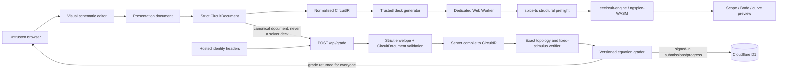
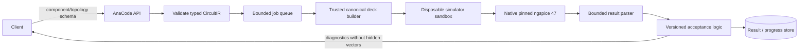

# AnaCode architecture

## Status and design goals

AnaCode is an analog-first challenge platform organized around a specification–design–simulate–submit–learn loop. The current repository is a vertical slice with nine challenge briefs, a browser simulator, a schematic editor, three server-side checkers, optional hosted identity, and D1 persistence.

The design goals are:

- immediate, useful circuit feedback in the browser;
- deterministic and reproducible verified results;
- no native-code or arbitrary-netlist execution in the server-side edge application;
- explicit versioning of problems, graders, models, and eventually simulator builds;
- graceful anonymous use with authenticated persistence;
- honest separation between implemented capabilities and roadmap content.

It is not currently a transistor-level signoff tool, an arbitrary model-hosting service, or a complete LeetCode-equivalent contest platform.

## Current system



There are two deliberately independent paths.

### Preview path

The primary interaction is a pick/place/wire schematic, not netlist authoring. `app/components/textbook-schematic-editor.tsx` stores a bounded presentation document for publication-style drawing behavior. Its simulation adapter maps only supported symbols and connectivity into the strict electrical `CircuitDocument` defined in `lib/circuit-document.ts`. Zod shape validation and semantic validation reject unknown fields, invalid pins, incomplete connectivity, conflicting grounds/net labels, invalid analyses, non-finite values, and excessive collection or sweep sizes. `compileCircuitDocument` then produces a normalized `CircuitIR` whose nets no longer depend on canvas coordinates.

`lib/circuit-spice.ts` is the code-owned adapter from `CircuitIR` to a generated deck. It owns node/device names, analyses, model selections, and the only model include; because it runs in the browser, this does not make it authoritative for grading. The visual MOS adapter uses the bundled `modelcard.CMOS90` with its `N90`/`P90` BSIM4 benchmark models; it does not claim a real fabrication process or signoff accuracy. The visual editor requests up to four voltage probes.

`app/workers/spice.worker.ts` uses `@spice-ts/core@0.3.0` only for structural preflight, after removing the one exact trusted model-card include that parser cannot resolve. Numerical execution calls `eecircuit-engine@1.7.0` directly; that package initializes its bundled ngspice WebAssembly engine. The worker normalizes operating-point, transient, DC-sweep, and complex AC data for the oscilloscope, curve tracer, and separate Bode magnitude/phase displays.

The worker permits exactly one `.op`, `.ac`, `.tran`, or `.dc` analysis. The pure policy module in `lib/simulator-netlist-policy.ts` limits each request to 12,000 bytes, 180 lines, 80 parsed components, 5,000 requested or returned points, 2,000 periodic-source events, and four voltage probes. Directives are allowlisted, with `modelcard.CMOS90` as the only include. Adversarial Node tests cover case variations, forbidden execution/file directives, untrusted includes, multiple or oversized analyses, periodic-source event bombs, byte/line limits, and malformed probe requests.

The worker protocol has explicit `ready`, `initialization-error`, and request-correlated `result` messages. The page allows up to 30 seconds for the large WebAssembly artifact to initialize; the four-second execution budget starts only after a matching protocol version is ready and the circuit request has been posted. One prewarmed worker accepts one simulation. It is terminated after its result and a replacement begins warming immediately. Cancellation, unmount, startup/run timeout, worker error, and stale result paths dispose or ignore the affected session. These are local availability safeguards, not a trust boundary, because an attacker controls the browser and can remove them.

The solver source is available only in a collapsed advanced panel. An expert can edit it, but the edited string runs solely through the same bounded local-preview worker and is not converted back into the schematic or sent verbatim to `/api/grade`. For the three supported fixed-topology judges, the client submits the canonical electrical `CircuitDocument` produced by the visual editor. The server does not accept the raw deck or the browser result, and it does not trust client-extracted values.

### Grade path

For one of the three supported judges, the client posts this typed envelope:

```ts
type FixedTopologySubmission = {
  problemSlug:
    | "precision-voltage-divider"
    | "rc-cutoff-1khz"
    | "inverting-gain-stage";
  problemVersion: 1;
  idempotencyKey: string; // UUID
  circuitDocument: CircuitDocumentV1;
};
```

`app/api/grade/route.ts` enforces request metadata and the 8 KiB endpoint limit, then `lib/grader.server.ts` applies a strict discriminated Zod schema. The document contract rejects unknown keys and bounds identifiers, collections, coordinates, analyses, numeric parameters, and total electrical state. `compileCircuitDocument(..., "simulation")` repeats semantic and connectivity checks on the server and produces coordinate-independent `CircuitIR`. The server selects the verifier by its fixed problem slug and never parses the user's preview netlist.

Each verifier requires the exact reference-to-device set, expected graph, ground relationship, and immutable stimulus for its problem. Extra, missing, disconnected, rewired, or source-tampered components fail before value extraction. Only after that check does the grader read the approved resistor/capacitor parameters and recompute ratios, cutoff frequency, gain, impedance, ranges, power/current limits, and declared supply/component-tolerance corners with deterministic equations. These are authoritative topology-and-equation judges for three narrow fixed-topology problems; they are not SPICE-backed free-topology judges. Grader versions are stored with their complete verdicts.

## Routes and ownership

| Route | Responsibility | Trust level |
|---|---|---|
| `/`, `/problems`, `/learn`, `/about` | Public product and curriculum surfaces | Static/public content |
| `/problems/[slug]` | Brief, simulator, and submission UI | Untrusted browser input |
| `/problems/new` | Guided local template form, live validation, inspection, and JSON export | Untrusted local form state; no server write |
| `/api/challenge-template` | Download the code-owned template v1 JSON | Static response; no upload or registration |
| `/lab` | Canvas editor and preview simulator | Untrusted browser input |
| `/api/grade` | Validation, grading, optional persistence | Server trust boundary |
| `/profile` | Authenticated progress/history | Requires hosted identity |
| `/leaderboard` | Future community-statistics status | No fabricated accounts or activity |

Challenge data lives in `lib/challenges.ts`. A challenge can be available for preview while its `judge` is null; in that case the submit control is explicitly practice-only.

## Identity and data model

Sites owns sign-in, OAuth cookies, callback routes, and injection of `oai-authenticated-user-*` headers. `app/chatgpt-auth.ts` reads those headers and validates relative return paths. The application has no password database.

The `DB` D1 binding is accessed through Drizzle:

- `users`: opaque platform ID, email, display name, first/last seen timestamps;
- `submissions`: canonical circuit-document JSON, complete result JSON, problem/grader versions, status, score, runtime, idempotency key, timestamp;
- `user_problem_progress`: best score, attempts, first solve, update time.
- `api_rate_limits`: an expiring shared fixed-window bucket keyed by a secret-keyed HMAC pseudonym of the trusted edge client address.

Anonymous grades are returned with `persisted: false`. For a signed-in user, `(user_id, idempotency_key)` is queried before writing. The same key for the same problem version and serialized circuit document returns the stored result with `replayed: true`; using it for a different request returns `409`. A new user upsert, submission insert, and progress upsert run in one transactional D1 batch. A unique-key race is re-read and replayed only when it is the same request, so progress cannot be incremented twice. A D1 failure logs only the error class name and does not turn a valid grade into a server error; persistence remains false.

The build plugin copies `.openai/hosting.json` and `drizzle/` to `dist/.openai/`. Sites can therefore provision the named D1 binding and apply the packaged forward migrations during deployment.

## Current security model

The Cloudflare Worker wraps responses with content-type, referrer, framing, cross-origin opener, permissions, HSTS, and CSP headers. The grade route additionally has content-type, streamed body-size, required same-origin, exact-schema, cache, a bounded per-isolate burst guard, and an atomic D1 fixed-window limit of 30 requests per minute for each HMAC-pseudonymized edge client address. Raw addresses are not persisted. Trusted edge traffic requires a 32-byte-or-longer runtime `RATE_LIMIT_HMAC_SECRET`; failure of the secret, D1, or limiter returns `503` instead of silently disabling distributed enforcement. Local preview, which has no trusted edge header, uses only the bounded in-process fallback. D1 access uses parameterized Drizzle statements and signed-in identity is obtained from the hosting boundary rather than submission data.

The D1 bucket provides shared fixed-window enforcement for this route, while the in-memory map absorbs small local bursts. The fixed-window state machine is regression-tested against real in-memory SQLite. It is still IP-oriented rather than account-oriented, can group visitors behind a NAT, and is not a daily quota, bot-management system, or WAF. Each HTML response receives a random nonce; all Vinext script and stylesheet elements are rewritten to carry it, `script-src-attr` is denied, and `script-src` no longer permits `'unsafe-inline'`. The current React UI still requires `style-src-attr 'unsafe-inline'`, while `'wasm-unsafe-eval'` remains narrowly allowed for local ngspice compilation.

This does not make the deployment invulnerable. Edge bot/WAF controls, authenticated daily quotas, operational alerting, retention/deletion workflows, independent testing, and an incident-response channel remain launch work. Runtime semantics are pinned with Cloudflare compatibility date `2026-08-29`; advancing that date or the pinned Vinext beta requires deliberate browser/API regression testing. [SECURITY.md](../SECURITY.md) is the normative security-status document.

## Challenge authoring boundary

`lib/challenge-authoring.ts` defines `anacode.challenge-template` version 1 as a portable declarative review artifact capped at 64 KiB. It describes metadata, specifications, a built-in starter preset, allowed and required components, editable parameters, one analysis, probes, public checks, and public descriptions of hidden-corner dimensions. Cross-reference validation binds all of those declarations to the selected starter plus one of the three registered server-owned grader IDs and exact implementation versions.

The schema intentionally cannot carry JavaScript, expressions, equations, arbitrary grader settings, SQL, URLs, model text, simulator directives, or netlists. The download route serves only the built-in example. `/problems/new` provides a guided local editor for learner-facing fields, live diagnostics, byte-budget feedback, JSON inspection, clipboard copy, and validated download while keeping the topology, analysis, and grader contract locked. There is no upload, persistence, publication, or dynamic registration endpoint. A template cannot make a new problem live by itself; a maintainer must implement and test a server verifier and explicitly register reviewed content.

## Analog Canvas decision

The product requested the book/paper visual quality of [Analog Canvas](https://analog-canvas.tokenzhang.com/editor). The project was reviewed at pinned commit `e34a33904549840ba054fd739df03ce352aa9643`, but the mutable hosted SPA was not adopted as a production component:

- it did not provide a stable, versioned embedding and message contract for this use case;
- imported project/SVG and generated SPICE would add parser/rendering trust boundaries;
- framing a third-party mutable origin would conflict with AnaCode's frame-denying policy and complicate credentials/CSP;
- the project is AGPL-3.0-only, so a modified hosted fork carries network source-availability obligations.

The current symbol artwork and typed electrical adapter are original code. Mature pinned libraries provide the interaction backend: `@xyflow/react@12.11.6` owns graph-canvas input, drag-box selection, connections, and viewport state, while `@tisoap/react-flow-smart-edge@5.0.0` provides worker-backed obstacle routing. AnaCode's custom React Flow `BaseEdge` renderer maps routed results to exact electrical pin coordinates, preserves authored orthogonal waypoints, and exposes the selected wire segments themselves as pointer and keyboard grips, so a segment can move while its endpoints remain attached. Every final leg is constrained to a horizontal or vertical `M/L` path; free-form circular controls and diagonal crossing decorations are intentionally absent. A selected component block moves with its fully owned junction subgraphs and internal waypoints while external nets stretch. Junctions are internal topology records created automatically when a learner branches onto a wire; deletion prunes degree-zero/one remnants and collapses unlabelled degree-two records, so they are neither palette components nor stranded selectable objects. A dot is rendered only for a true three-or-more-way connection. Proper VCC/VDD power ports and multiple local ground glyphs compile to global named rails and a single electrical ground. No Analog Canvas source or assets are bundled, and the hosted application is not framed. A future integration is possible only as a pinned, audited, self-hosted fork on a separate credentialless origin, with schema/SVG sanitization, a documented compatibility layer, the independent `CircuitDocument`/`CircuitIR` boundary, and satisfied licensing obligations. Even then, its exported SPICE would not be trusted judge input.

## Target authoritative simulator architecture

The roadmap target is native ngspice 47 as the primary authoritative engine because it supports the analyses/device models needed for analog curricula. That service does not exist in this snapshot. It is distinct from the untrusted browser's ngspice-WASM preview, cannot safely run inside the current edge Worker, and must be isolated behind a job service.



Required properties:

1. `CircuitIR` is a versioned tagged union. It allows known devices, pins, numeric parameters, analyses, and model IDs; it has no raw directive/string escape hatch.
2. The deck builder alone creates identifiers, directives, sweeps, output commands, and model includes from pinned templates.
3. Each job runs in a new non-root sandbox with no network or secrets, no host mounts, a read-only root, a small fresh temporary filesystem, dropped capabilities, `no_new_privs`, syscall filtering, and preferably gVisor or microVM isolation.
4. Queue admission and the sandbox independently enforce component/sweep/model counts, CPU, wall time, memory, processes, file sizes, stdout/stderr, and result points.
5. The parser accepts only bounded numeric output and maps errors to stable public codes. Paths, raw logs, model text, and hidden cases remain server-side.
6. A verdict records problem version, grader version, deck-template version, model-set hash, simulator build hash, and relevant numerical tolerances.
7. Analytical problems retain equation oracles; advanced problems are regression-tested against a secondary simulator/oracle to catch convergence- or version-specific surprises.

ngspice's distribution contains components under multiple licenses, and model libraries have independent terms. Binary/model redistribution requires a release-specific license inventory and corresponding notices/source obligations. The installed `eecircuit-engine` npm package has a top-level MIT license, but its distribution bundle also embeds ngspice WebAssembly and model cards without a complete separate notice inventory in the tarball. The exact corresponding ngspice source/build revision and every model source are not pinned for the installed artifact. This is a stop-ship gate for any external hosted deployment—public or access-controlled—or other redistribution of the current browser bundle, not merely future native-service work. See [simulator-provenance.md](simulator-provenance.md).

## Problem and grader evolution

A production problem should be an immutable versioned package containing:

- public statement, allowed topology/schema, constraints, examples, and starter design;
- private parameter/corner vectors and tolerances;
- canonical model references and simulator configuration;
- deterministic scoring and diagnostic policy;
- analytical or simulator-based oracle fixtures;
- adversarial, convergence, boundary, and regression tests.

Publishing an edit creates a new problem or grader version. Existing submissions retain the versions that produced their verdict. Regrading should be an explicit audited operation, not a silent mutation.

The current authoring template supports this review process but does not automate publication. It may select only a registered implementation and matching built-in preset; it cannot define executable acceptance logic.

## Roadmap

### Gate 1 — harden the current slice

- Resolve the browser simulator stop-ship gate by pinning complete corresponding source/build/model provenance and satisfying all notices/source obligations, or replace/rebuild the artifact before any external hosted deployment.
- Add edge WAF/bot controls, authenticated/anonymous daily quotas, structured telemetry, and alerting on top of the current D1 write-route limiter.
- Replace CSP inline allowances where the framework permits.
- Add property/fuzz tests for engineering-number parsing, schema boundaries, and worker limits.
- Add privacy, retention, export, and deletion workflows.
- Establish monitored vulnerability reporting and incident response.

### Gate 2 — authoritative native simulation

- Freeze and version the existing `CircuitIR` and canonical deck contract for server transport and replay.
- Build the isolated native ngspice 47 worker service and bounded queue.
- Pin/test models and simulator builds; add differential oracles.
- Commission an independent sandbox and web-application review before authoritative free-topology verification is released.

### Gate 3 — product depth

- Convert the six practice-only briefs into benchmarked judges.
- Add editorials, test-case explanations that do not leak private vectors, progression, ratings, contests, and review workflows.
- Expand the editor only through typed devices and audited model packs.
- Populate leaderboards exclusively from real accepted, persisted submissions.

This ordering keeps the educational UX moving without confusing a fast local preview with an authoritative analog-design verdict.
