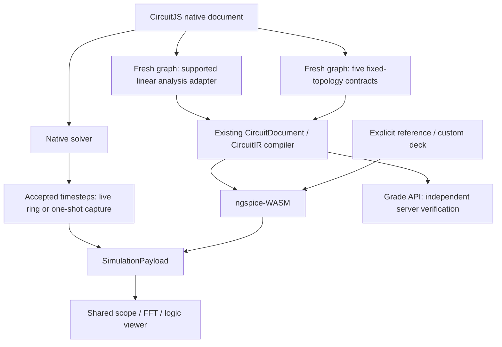

# Architecture

## Editor and simulation

The primary editor is a pinned, self-hosted build of [CircuitJS1](https://github.com/pfalstad/circuitjs1). Its native component classes, wires, junctions, coordinate grid, hit testing, undo history and solver own the electrical document. A presentation adapter draws supported symbols from official KiCad SVG geometry, while native drawing maintains terminal interaction and labels. The GPL editing patch delegates routing, junction splitting and value changes to existing native element/editor methods. AnaCode does not implement a replacement schematic backend.

`CircuitJsWorkbench` loads `/circuitjs/circuitjs.html` in a same-origin iframe. The native JavaScript API exposes circuit import/export, elements and accepted solver timesteps. The GPL patch exposes existing native node IDs, terminal coordinates, element serialization, hovered element and viewport projection, plus native routed-wire commands, inline numeric editing and theme control. The source archive, patch and build script are downloadable from the editor's license page.

`CircuitJsWorkbench` combines schematic editing, named probes, scope/FFT, logic analysis, SPICE and design checks in one workspace. Tabs, stacked panels and side-by-side editor/measurements are presentation layouts over the same mounted native circuit. Parts-only exercises and converter lessons can supply wiring instructions, block diagrams and recommended native node probes.

```mermaid
flowchart TD
  native["CircuitJS native document"] --> solver["Native solver"]
  solver --> capture["Accepted timesteps: live ring or one-shot capture"]
  capture --> payload["SimulationPayload"]
  native --> analysis["Fresh graph: supported linear analysis adapter"]
  native --> grading["Fresh graph: five fixed-topology contracts"]
  analysis --> document["Existing CircuitDocument / CircuitIR compiler"]
  grading --> document
  document --> spice["ngspice-WASM"]
  document --> grade["Grade API: independent server verification"]
  reference["Explicit reference / custom deck"] --> spice
  spice --> payload
  payload --> instruments["Shared scope / FFT / logic viewer"]
```

The SPICE panel uses `eecircuit-engine` with the existing ngspice-WASM artifact and `@spice-ts/core` structural preflight. Each execution gets a fresh bounded Web Worker, terminated on completion, error or cancellation. The worker validates the input and probe list, inserts a required SPICE title line, runs the solver, and normalizes real or complex vectors. Unsupported or missing requested vectors produce errors instead of substituted traces. Failed or pending runs clear previous SPICE results from the shared viewer.

Schematic mode reads native node IDs and exact exported numeric attributes on every Run through `lib/circuitjs-analysis.ts`, then uses the existing document compiler and deck generator. It currently supports resistors, ideal capacitors, unsaturated inductors, ideal DC/sine voltage sources and rails, and ideal DC current sources. Unsupported device models, source waveforms and nonideal parameters stop conversion explicitly. The user can instead select the separate reference/custom deck; the UI states that schematic edits are not reflected in that deck, and this is never an automatic fallback. Generated schematic decks are read-only.

Supported SPICE analyses are operating point, DC sweep, AC sweep and transient. Results are actual ngspice vectors. Source-branch current is supported when present in the solver output. AC magnitude is 20 log10 of the complex voltage magnitude; it is not automatically a transfer-function ratio unless the input is a unit AC source. The TIA exercise explicitly divides output by its specified current amplitude.

CircuitJS and ngspice have different device models. Educational native transistor models do not claim equivalence to the ngspice CMOS90 BSIM models. Reference/custom SPICE decks remain independent of the native graph. A schematic-mode ngspice transient starts a new response from its operating point; it does not import the native solver's running state. The complete native component library remains usable for live measurements even when a corresponding SPICE conversion is unsupported.

## Native documents and probe identity

CircuitJS owns its native XML and legacy text formats. Exported circuit files are usable in the upstream editor. AnaCode accepts either format with a byte/line limit and rejects unrelated files. Native local saves also retain app probe metadata. Existing legacy AnaCode documents and graph utilities remain covered by compatibility unit tests; the custom canvas is no longer the primary editor.

A voltage probe references an actual native element terminal and its solver node ID. It therefore measures the entire connected net regardless of whether that net has a visible label. A current probe references a supported native two-terminal element. Native node IDs determine association; SVG line overlap is never used by the adapter.

Each probe has an identity, name, color and enabled state. Up to 32 probes may be present. Deleted native elements invalidate their probes. Schematic markers use the native viewport projection, and matching trace colors pass through to the shared viewer.

Live acquisition subscribes to native `ontimestep` callbacks and records actual accepted samples in fixed-size Float64 ring buffers. The default target is 65,536 samples per channel, with a selectable maximum of 131,072. Time plus all channels share a 2,097,152-value (16 MiB) acquisition-storage budget; capacity is the smaller of the requested count and `floor(2097152 / (channels + 1))`. A visible warning reports reduced depth. Published numeric snapshots and rendering have additional bounded storage. Old samples are overwritten and the latest time window is published at most twice per second. The previous callback and maximum timestep are restored on cleanup. Freeze holds the measured record without pausing the circuit. A reset clears history; graph edits restart acquisition using surviving probes.

One-shot capture retains adaptive sample times, stops at the requested duration or bounded sample limit, and pauses the circuit. Graph changes or reset during one-shot capture cancel that record. It shares the 131,072-sample maximum and combined numeric-value bound. FFT resamples only according to the documented quality checks; it does not fabricate missing oscillations.

## Waveform analysis

`SimulationPayload` carries the engine, analysis, x axis, traces, units, operating-point entries and warnings. `ScopeResult` separates incompatible units into distinct plots and displays the same data from both real engines. `BrowserOscilloscope` owns only presentation and measurement interaction.

`lib/waveform-analysis.ts` contains time-aware statistics and sample preparation. `fft.js` performs transforms up to 131,072 samples. Window normalization, DC/Nyquist handling, adaptive sampling and coherent-record checks have analytic regression tests. The logic view classifies measured voltages with configurable low/high thresholds and an unknown band, and can combine up to 16 selected channels into a binary/hex bus. It reads actual acquired samples rather than simulating gates or inventing unseen transitions. Detailed controls and limitations are in [waveform-instruments.md](waveform-instruments.md).

## Grading boundary

Five exercises have authoritative fixed-topology graders: precision divider, RC filter, inverting amplifier, wire an ADC reference, and wire an anti-alias filter. The latter two start with disconnected parts. Check reads the current CircuitJS circuit afresh through `lib/circuitjs-grading.ts`, translating supported native elements and solved connectivity into the existing strict `CircuitDocument`. Edits after an earlier preview are included in the submitted graph without a separate preparation action. It never submits a cached starter in place of the edited circuit. Parts-only exercises must pass wiring validation before SPICE analysis and cannot select a separate reference deck.

The adapter uses numeric native serialization rather than rounded UI labels. Unsupported components, source changes and model settings are rejected. The server independently validates every submitted document using Zod, compiles coordinate-independent `CircuitIR`, checks exact topology and stimulus, then recomputes its versioned analytical grade. Client vectors and verdicts are never grading evidence.

The retained version-1 document describes IDs, references, component kinds and parameters, placements/orientations, typed pin/junction endpoints, wires, labels, probes and analyses. `lib/circuit-document.ts` owns its schema and compiler. `lib/circuit-spice.ts` owns generated decks. No arbitrary SPICE can enter the authoritative grader.

## Accounts and persistence

Supabase Auth manages passwords, email confirmation and recovery. `app/auth.ts` verifies identities through `supabase.auth.getUser()`; request-supplied identity headers and unverified local session data have no authority. Server-only forms use PKCE callbacks, same-origin POST validation and HttpOnly cookies. Middleware rotates expired tokens and propagates the replacement cookies to the route and response. See [supabase.md](supabase.md).

D1 uses parameterized Drizzle queries:

- `users`: verified Supabase UUID, display name and email.
- `submissions`: canonical document, result, grader version and idempotency key.
- `user_problem_progress`: attempts, best score and solve state.
- `api_rate_limits`: expiring shared buckets keyed by a secret-derived client pseudonym.

A submission transaction upserts the user, submission and progress together. Replayed idempotency keys do not increment attempts. Anonymous simulation and practice grading remain available; persistence failures are reported honestly. `/api/progress` returns only the verified user's solved slugs and uses private, no-store responses.

The 21 worked numerical exercises use local calculation checks and device-local completion, separately from authoritative design grading. Their solutions are public learning content. Search and progress filters merge that local completion with server-verified solved slugs.

## HDL coding and logic waveforms

`/hdl` is a separate digital coding track with six original exercises and a counter playground. `HdlWorkspace` uses CodeMirror 6 for `design.sv` and `tb.sv`, draft restore, and Verilog 2005/SystemVerilog 2012 selection. Icarus implements a supported SystemVerilog subset; classes, UVM and full SVA are not promised.

`lib/hdl-client.ts` starts a fresh module Web Worker for each run. The pinned official Icarus source-built WebAssembly distribution executes its real `ivlpp`, `ivl` and `vvp` stages via in-memory filesystems. A 20-second wall-clock deadline (including loading) and explicit cancellation terminate the worker, including endless delta-cycle loops. The adapter bounds each input source at 128 KiB, preprocessed code at 1 MiB, console output at 256 KiB and each generated file at 8 MiB. Generated filesystem storage is additionally bounded at 32 MiB across 128 files, and each WebAssembly stage has a 256 MiB heap ceiling. Source and testbench code stay in the browser; no external simulation service receives them.

The testbench's real `dump.vcd` is imported through the unmodified VCDrom 1.6.0 viewer's own file input in a same-origin iframe. The wrapper checks parent origin and input size. Resizable problem/editor/results panes, console/waveform tabs and stacked or split output layouts present compiler diagnostics and actual logic transitions. Run uses the edited testbench; Submit uses the original supplied testbench against the edited design. These are transparent local practice checks, with last-submission status stored only in this browser, not authoritative server grades or account progress. Analog topology grading remains a separate trust boundary.

Project export packages source files, a Windows launcher and Makefile targets for OSS CAD Suite with Icarus, Yosys and GTKWave. Yosys synthesis is a local exported-project integration, not a claimed in-browser engine. Complete corresponding Icarus source, static-link patch, pinned toolchain/build inputs and licenses accompany the deployed runtime under `/hdl/icarus/`; the app MIT license does not supersede Icarus/GPL licensing. VCDrom and CodeMirror retain their own notices. See [hdl-workspace.md](hdl-workspace.md) and [icarus-source-build.md](icarus-source-build.md).

## Hosting and response policy

The full React/Vinext app runs on Cloudflare Workers, using the existing GitHub CI/deploy workflow. GitHub Pages continues to publish the separate static showcase. Vite emits the Worker, client assets and generated Wrangler config. The `ASSETS` binding serves the pinned native editor and HDL runtime/viewer assets with dedicated route policies.

Application HTML uses per-response CSP nonces, prohibits inline script handlers and permits only same-origin frames. Only the `/circuitjs/` runtime permits the inline/eval behavior required by its GWT loader. HDL runtime and viewer routes have a separate same-origin policy permitting WebAssembly compilation without general JavaScript eval. Application CodeMirror stylesheet elements carry the response nonce. The GWT exception does not apply to account or application pages. Supabase cookies are HttpOnly; the iframe receives no direct Auth client or credentials.

The static `public/_headers` policy mirrors the native runtime restrictions when assets are served directly. Source and license downloads remain available offline with the project. Native circuit, KiCad presentation and HDL runtime files have checked SHA-256 inventories.

D1 schema SQL lives in `drizzle/`. For a new database, configure the actual database binding and apply these migrations before expecting saved progress. Existing schema data is preserved by this feature. Worker authentication settings are runtime secrets; no Supabase project credentials are committed.

## Validation

`npm run typecheck`, `npm run lint`, `npm test` and `npm run test:e2e` are the primary checks. The ngspice, CircuitJS/KiCad and HDL distributions have artifact audits. Unit/integration tests run real ngspice calculations, compare every new numerical solution, test auth through the official SDK, and reject grading tampering. Browser tests load actual native circuits and exercise routing, inline value edits, probe capture, live/freeze, FFT, logic views, layouts, fresh-graph grading, saved progress and auth UI flows. HDL unit tests execute all six reference designs in the bundled Icarus engine; browser tests cover source editing, fixed practice checks, genuine VCD imports, repeat runs, drafts, layouts and cancellation.

Playwright compares native RC, CMOS and Sallen–Key canvas screenshots against reviewed baselines in `tests/e2e/visual-baselines/`. The tolerance accommodates minor Chromium font rasterization differences; it is not a proof that every arbitrary user layout avoids overlap. Review changed baselines visually before accepting an update. Representative application captures are documented in [screenshots/README.md](screenshots/README.md).

A live Supabase project, redirect configuration and inbox are still needed to validate actual signup and email delivery. The local tests never report mocked network responses as live account verification.
